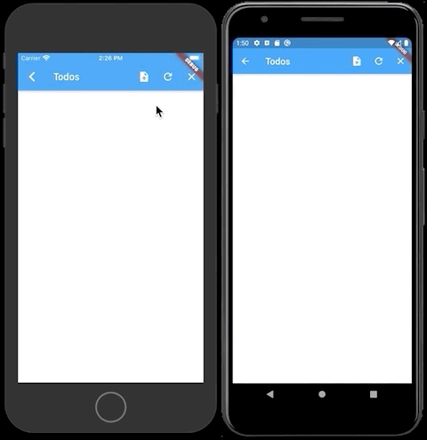

# Flutter Amplify DataStore Example
Example of using Amplify DataStore in a Flutter mobile app. The goal of this example is to show how to provide a temporary Flutter DataStore solution that can be used until one is provided by the real Amplify Flutter SDK.

The solution is implemented as a Flutter [platform plugin](https://flutter.dev/docs/development/platform-integration/platform-channels) that lives alongside the [Amplify Flutter (Developer Preview)](https://github.com/aws-amplify/amplify-flutter). Underneath, it registers the native [Android](android/src/main/kotlin/com/kjones/amplify_datastore/AmplifyDataStorePlugin.kt) or [iOS](ios/Classes/SwiftAmplifyDataStorePlugin.swift) Amplify DataStore, and Api plugins. Then exposes a [DataStore-like interface](lib/amplify_datastore.dart) to the Flutter Dart code using [method](https://api.flutter.dev/flutter/services/MethodChannel-class.html) and [event](https://api.flutter.dev/flutter/services/EventChannel-class.html) channels.

This example is not a generic DataStore solution for Flutter. Native Android and iOS DataStore implementations rely on being able to locate model classes generated with `amplify codegen models`. Therefore, each time you update the [GraphQL schema](example/amplify/backend/api/todo/schema.graphql) you will need to regenerate the [Android](android/src/main/java/com/amplifyframework/datastore/generated/model/) and [iOS](ios/Classes/generated/models/) platform specific models. You will also need to hand-code the [Flutter DataStore models](lib/models/) since the Amplify CLI does not currently support DataStore.

To demonstrate that the example plugin interoperates alongside the Amplify Flutter developer preview it has Cognito authorization enabled on the GraphQL API. Therefore, on first use, it requires the user to create an account, or sign in.

## Getting Started
To run this example you will need to use the Amplify CLI to deploy the backend services into your AWS account. This will generate an `amplifyconfiguration.dart` file which can then be used to build the example Flutter app.

### Create the backend resources
1. If you don't have it already, install the Amplify-Flutter Developer Preview version of the Amplify CLI by running:
   ```bash
     npm install -g @aws-amplify/cli@flutter-preview
   ```
1. Clone this repository. Ex:
   ```bash
   git clone https://github.com/kjones/flutter-datastore-example.git
   ```
1. Deploy the backend Amplify services into your AWS account.
   
   ```bash
   cd flutter-datastore-example/example
   amplify init
   ```
   Optional: You can list the Amplify services that will get created during the `amplify push` stage if you are curious. The following should show that `Auth`, and `Api` services will get created.
   ```bash
   amplify status
   ```
   Deploy the Amplify services. When asked, **"Do you want to generate code for your newly created GraphQL API (Y/n)"**, answer **"No"** since the Amplify CLI does not yet support GraphQL Flutter code generation.
   ```bash
   amplify push
   ```
### Build and run the example Flutter app
1. Run Android Studio and open the example plugin project from the root of the cloned repository.
1. Run Flutter Pub Get.
1. Start and Select a device or emulator ([see Flutter docs](https://flutter.dev/docs/development/tools/android-studio#running-and-debugging))
1. Run the app.

## Screenshot



## Clean up Amplify services
From the example app folder, delete the Amplify services.
```bash
cd example
amplify delete
```
 